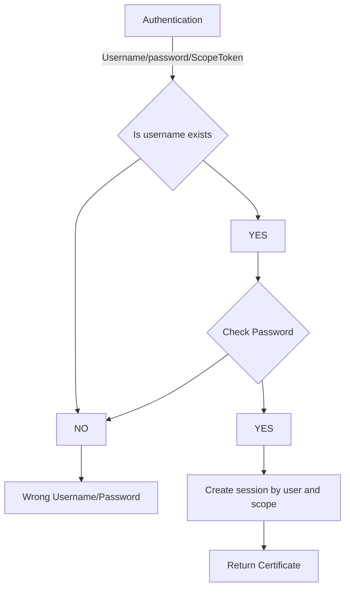
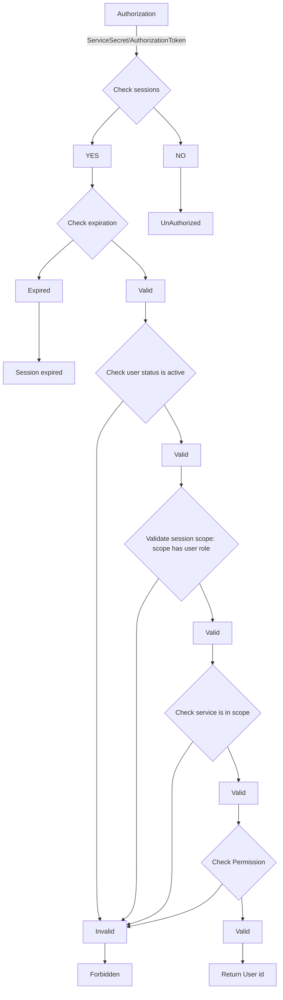
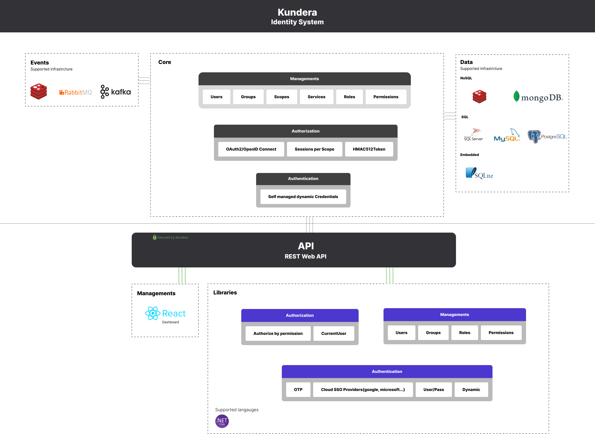
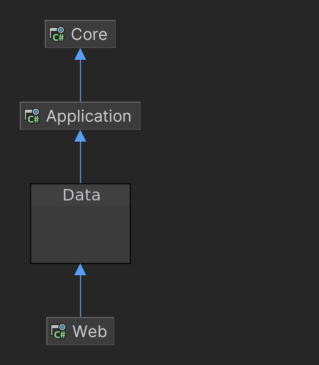
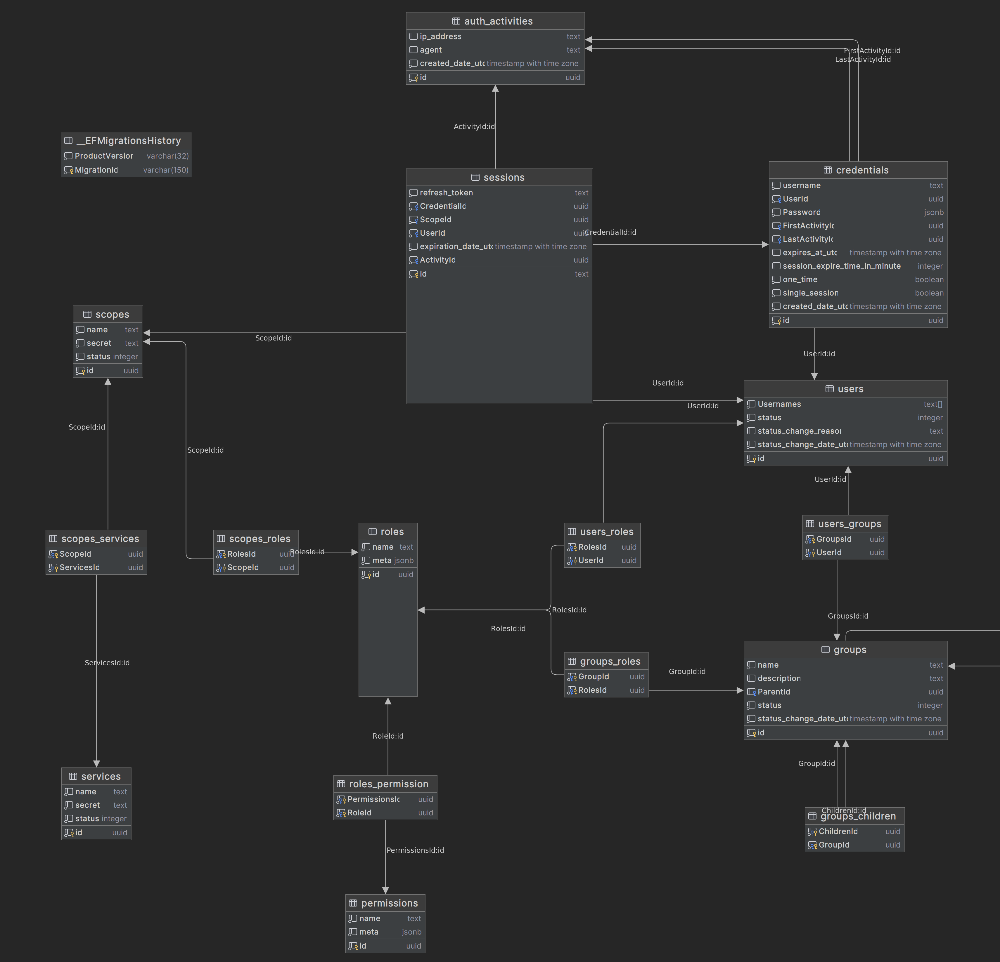

# Kundera Identity Service

Kundera Identity service is a cloud-based identity service that provides:

- Groups for handling organizational chart and users
- Scopes and services for supporting Single Sign-On (SSO)
- Roles and permissions to handle Access Control List (ACL)
- Session management and multiple credential and username for single user
- OAuth2 and RefreshToken mechanism for authentication
- REST API protocol for managing all the actions
- DotNet libraries for adding authorization and authentication support to your AspNetCore and FastEndpoint projects

Kundera Identity service is named after the writer Milan Kundera's novel "Identity" which explores the intimate relationship between two lovers and their sense of identity .

The following sections will describe the features, architecture, installation, usage, and documentation of Kundera Identity service.

## Features

Kundera Identity service offers a comprehensive set of features for managing identity resources in a cloud environment. Some of the main features are:

### Groups

Groups are collections of users that share common attributes or roles. Groups can be used to represent organizational units, teams, projects, or any other grouping criteria. Groups can have subgroups to create hierarchical structures. Groups can also have associated scopes and services that define what resources they can access.

### Scopes and Services

Scopes are sets of permissions that grant access to specific resources or actions. Services are logical entities that group related scopes together. For example, a service could be an application or a web site that requires authentication. Scopes and services can be assigned to groups or individual users to enable SSO across different applications.

### Roles and Permissions

Roles are predefined sets of permissions that can be assigned to groups or users. Permissions are fine-grained actions that can be performed on specific resources. For example, a role could be an administrator or a manager, while a permission could be read or write access to a database table. Roles and permissions can be used to implement ACLs for controlling access to sensitive data.

### Session Management

Session management handles the creation, validation, expiration, and revocation of sessions for authenticated users. Sessions are stored in cookies or local storage on the client side, and in PostgreSQL database on the server side. Sessions can have different expiration policies based on user preferences or security requirements.

### Multiple Credential and Username for Single User

Kundera Identity service supports multiple credential types for authenticating users:

- Default: authenticate with username and password
- OneTime: authenticate with username and password just one time (handling OTP or etc...)
- TimePriodic: authenticate with username and password in a period of time

Users can also have multiple usernames associated with their account, such as email address, phone number,
social media account name etc.

### OAuth2 and RefreshToken Mechanism

OAuth2 is an open standard for authorization that allows third-party applications to access user's data without exposing their credentials. Kundera Identity service supports OAuth2 as an identity provider (IdP) that issues access tokens
and refresh tokens to authorized clients.

Access tokens are short-lived tokens that grant access to specific scopes
and services.

Refresh tokens are long-lived tokens that allow clients to obtain new access tokens when they expire.

### REST API Protocol

REST API protocol is a standard way of communicating between clients
and servers using HTTP methods (GET,
POST etc.)
and JSON format (for request body
and response body).

Kundera Identity service provides REST API endpoints
for managing all the identity resources,
such as groups,
scopes,
services,
roles,
permissions,
sessions,
credentials,
usernames etc.

The REST API documentation describes
the available endpoints,
parameters,
responses,
and examples
for each resource type.

### DotNet Libraries

DotNet libraries are packages
that provide easy integration
of Kundera Identity service
with your AspNetCore
and FastEndpoint projects.

AspNetCore library adds middleware components
that handle authentication
and authorization requests
from your web applications.

FastEndpoint library adds attributes
that decorate your endpoints
with required scopes
and roles for accessing them.

## Architecture

Kundera Identity service is built on DotNet 7 framework using C# language.
It follows a microservice architecture pattern where each resource type has its own dedicated microservice.
The microservices communicate with each other using Kafka message broker.
The microservices also interact with PostgreSQL database as a primary data store
and as a storage for database migrations using Flyway tool.
The microservices expose REST API endpoints using Swagger UI tool.
The microservices are containerized using Docker technology

: https://en.wikipedia.org/wiki/Identity_(novel)
: https://www.goodreads.com/book/show/28635.Identity
``

- - -
- - -

# Technical
### Authentication flow:

### Authorization flow:

### Modules

### Database schema

- - - 
- - -
## Events

### Credentials

- `kundera.credential.created`
- `kundera.credential.password.changed`

- - -

### Sessions

- `kundera.sessions.created`
- `kundera.sessions.expired`
- `kundera.sessions.terminated`

- - -

### Users

- `kundera.users.created`
- `kundera.users.role.added`
- `kundera.users.role.removed`
- `kundera.users.status.changed`
- `kundera.users.group.joined`
- `kundera.users.group.removed`
- `kundera.users.username.added`
- `kundera.users.username.removed`

- - -

### Groups

- `kundera.groups.created`
- `kundera.groups.child.added`
- `kundera.groups.child.removed`
- `kundera.groups.parent.changed`
- `kundera.groups.role.added`
- `kundera.groups.role.removed`
- `kundera.groups.status.changed`

- - -

### Roles

- `kundera.roles.created`
- `kundera.roles.permission.added`
- `kundera.roles.permission.removed`

- - -

### Permissions

- `kundera.permissions.created`

- - -

### Scopes

- `kundera.scopes.created`
- `kundera.scopes.role.added`
- `kundera.scopes.role.removed`
- `kundera.scopes.service.added`
- `kundera.scopes.service.removed`
- `kundera_scopes.status.changed`

- - -

### Services

- `kundera.services.created`
- `kundera.services.status.changed`
